# Car Plate Detect
---
:boom: Car plate detection using MATLAB   MATLAB kullanarak araba plakası tespiti

Test 1
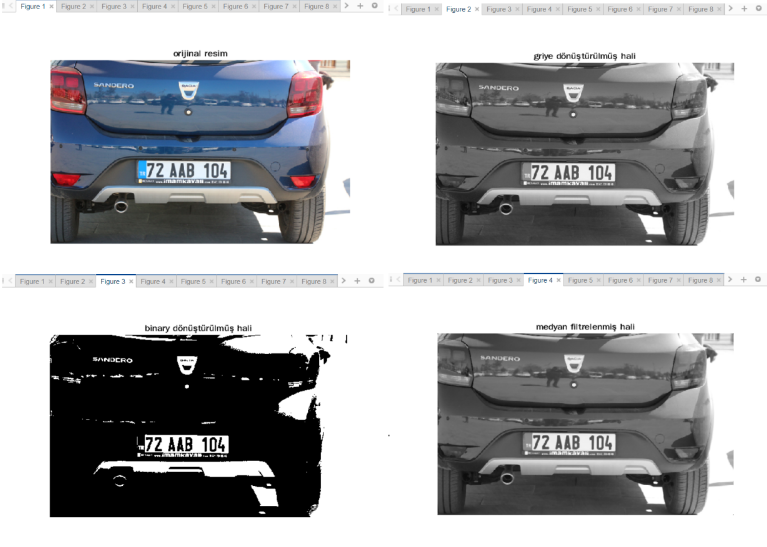
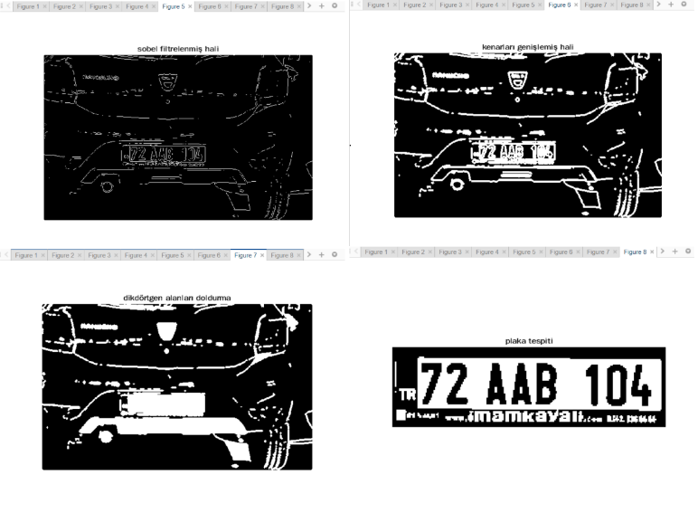
 
Test 2
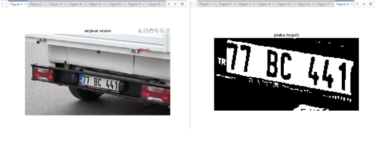
 
Test 3
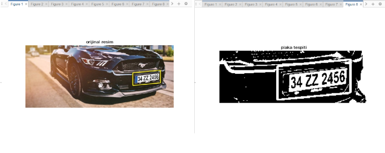
 
Test 4
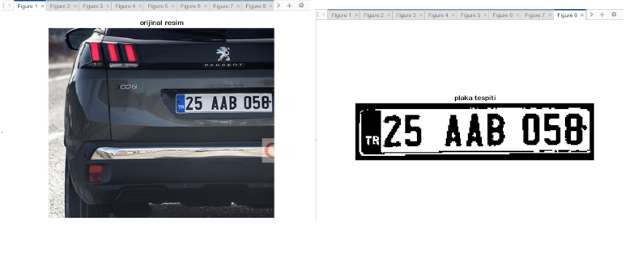
 
Test 5
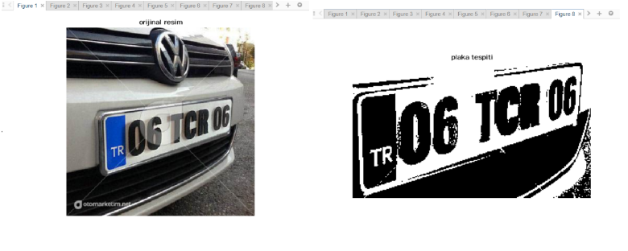
 
Test 6
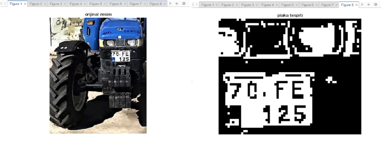
 
Test 7
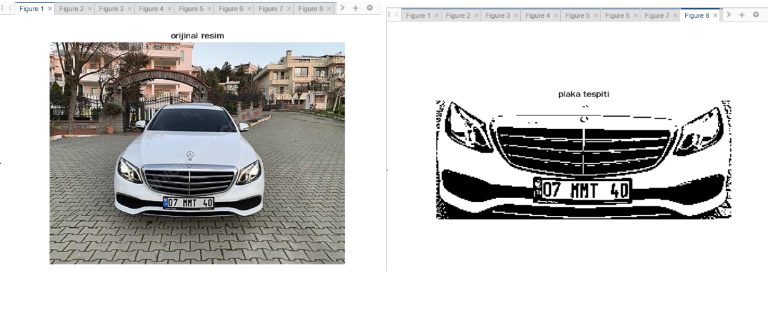
 
Test 8
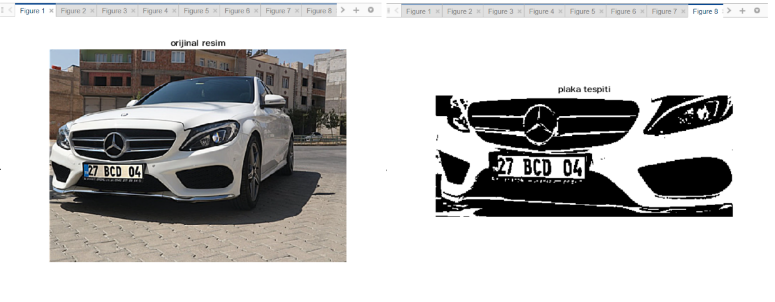
 
Test 9
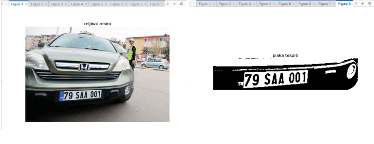
 
Test 10
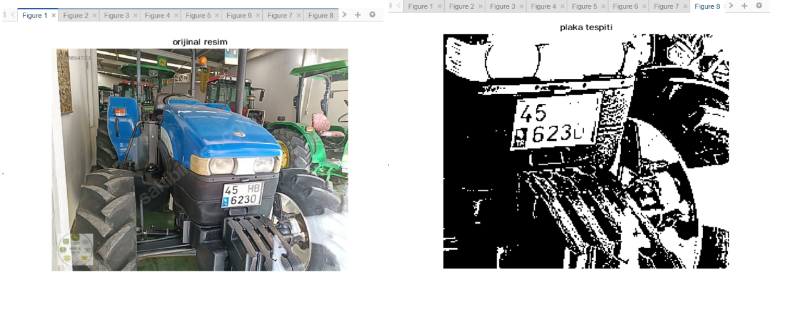
 
Test 11
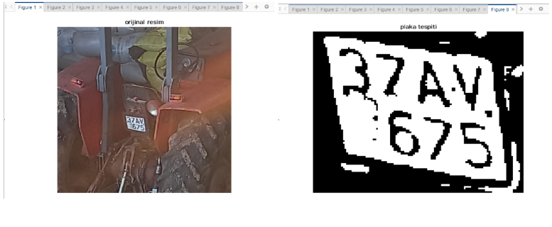
 
Test 12
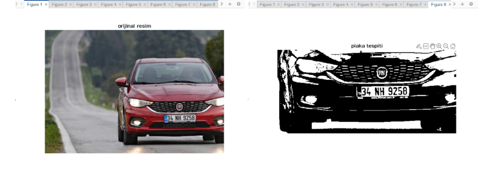